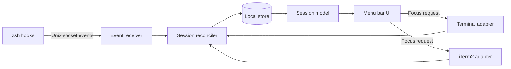

# ShellCue 개발 계획

문서 상태: MVP 실행 계획  
대상 플랫폼: macOS 14 이상 후보  
대상 터미널: macOS Terminal, iTerm2  
대상 셸: 별도 연동 없음

> 2026-09-23 결정: zsh hook과 명령 이벤트 수집은 사용자 가치보다 설치·설명 부담이 커 MVP에서 제외했다. 아래의 zsh 연동 및 이벤트 수신 설계는 초기 검토 기록이며 현재 구현 계획이 아니다. 상태는 터미널 API와 로컬 프로세스 정보로만 판정한다.

## 1. 개발 원칙

- 터미널 앱과 상태 수집기를 분리한다.
- 상태는 추측보다 관측된 이벤트를 우선한다.
- 일부 연동이 실패해도 이름·메모·목록을 사용할 수 있게 한다.
- 터미널 출력 전문을 읽거나 저장하지 않는 방향을 기본으로 한다.
- 터미널이나 셸을 느리게 만들지 않는다.
- MVP에서는 로컬 단일 사용자 환경만 지원한다.

## 2. 제안 기술 구성

### macOS 앱

- Swift 6
- SwiftUI `MenuBarExtra` 기반 메뉴 막대 UI
- AppKit 보완: 창 활성화, 전역 단축키, 메뉴 막대 패널 제어가 필요한 경우
- SwiftData 또는 SQLite: 세션 메타데이터와 이벤트 저장
- UserNotifications: MVP 후반의 선택적 완료 알림
- SMAppService: 로그인 시 실행

SwiftData와 SQLite 중 선택은 기술 실험에서 결정한다. 저장 구조가 단순한 MVP는 SwiftData가 빠르지만, 이벤트 이력과 마이그레이션 제어가 중요하면 SQLite가 더 예측 가능하다.

### zsh 연동

가벼운 zsh 스크립트를 설치해 다음 이벤트를 앱으로 보낸다.

- `shell_started`
- `command_started`
- `command_finished`
- `cwd_changed`
- `shell_exited`

zsh의 `preexec`, `precmd`, `chpwd`, `zshexit` hook을 사용한다. 각 이벤트에는 임의 생성한 셸 인스턴스 ID, TTY, PID, 현재 경로, 시간, 필요한 최소 명령 정보, 종료 코드를 포함한다.

전송 방식 후보는 Unix domain socket이다. 앱이 종료된 경우 hook은 즉시 실패하고 셸을 막지 않아야 한다. 파일 append 방식은 복구가 쉽지만 동시성·정리·권한 관리 부담이 있어 보조 경로로만 검토한다.

### 터미널 어댑터

공통 인터페이스 뒤에 앱별 구현을 둔다.

```swift
protocol TerminalAdapter {
    var terminalKind: TerminalKind { get }
    func discoverSessions() async throws -> [TerminalSessionSnapshot]
    func focus(session: TerminalTarget) async throws
    func refresh(target: TerminalTarget) async throws -> TerminalSessionSnapshot?
}
```

- `AppleTerminalAdapter`: Terminal의 AppleScript 사전을 사용한다.
- `ITermAdapter`: 1차 기술 실험에서 Python API와 AppleScript의 역할을 결정한다.
- `UnsupportedTerminalAdapter`: zsh 이벤트는 보이지만 정확한 창 이동을 제공할 수 없는 터미널을 표현하는 확장 지점이다.

## 3. 확인된 기술 기반

현재 개발 Mac의 앱 스크립팅 정의에서 다음 항목을 확인했다.

### macOS Terminal

- 창 ID
- 탭 TTY
- 탭 `busy` 상태
- 현재 프로세스 목록
- 선택된 탭 여부
- 사용자 지정 탭 제목

### iTerm2

- 창, 탭, 세션 계층
- 세션 ID와 TTY
- `is processing`
- `is at shell prompt`
- 세션 선택
- 세션 이름

공통 연결 키는 TTY를 우선 사용한다. TTY는 세션 수명 동안 안정적이지만 재사용될 수 있으므로 영구 ID로 단독 사용하지 않는다.

```text
zsh instance id + shell pid + tty
                 │
                 ▼
          Session Reconciler
         ┌───────┴────────┐
         ▼                ▼
 Terminal adapter     iTerm adapter
 window + tab         window + tab + pane
```

앱 재시작 후에는 현재 터미널 스냅샷과 살아 있는 셸 PID, TTY, 저장된 최근 연결 정보를 함께 사용한다. 일치 여부가 불확실하면 기존 이름을 임의로 붙이지 않고 사용자에게 재연결을 제안한다.

## 4. 시스템 구성



### 주요 모듈

| 모듈 | 책임 |
|---|---|
| Event receiver | zsh 이벤트 수신, 형식 검증, 중복 제거 |
| Session reconciler | 셸 이벤트와 터미널 탭/pane을 하나의 세션으로 결합 |
| Terminal adapters | 세션 발견, 앱별 식별 정보, 정확한 위치로 이동 |
| Session store | 용도, 메모, 프로젝트, 최근 상태와 닫힘 기록 저장 |
| Command sanitizer | 명령에서 민감한 인자 제거 및 안전한 요약 생성 |
| Role suggester | 명령과 경로를 이용한 로컬 용도 제안 |
| Menu bar UI | 검색, 그룹, 상세, 편집, 상태 표현 |
| Integration manager | zsh 연동 설치, 상태 확인, 제거 |

## 5. 데이터 모델 초안

### IndexedSession

| 필드 | 설명 |
|---|---|
| `id` | ShellCue 내부 UUID |
| `shellInstanceID` | zsh 시작 시 생성한 UUID |
| `terminalKind` | `appleTerminal`, `iTerm2`, `unknown` |
| `terminalSessionID` | 앱이 제공하는 세션/탭 식별자 |
| `tty` | 현재 TTY |
| `shellPID` | 셸 프로세스 ID |
| `projectID` | 연결된 프로젝트 |
| `purpose` | 사용자에게 보이는 용도 |
| `purposeSource` | `suggested`, `user`, `terminalTitle` |
| `nextAction` | 다음 할 일 한 줄 |
| `cwd` | 마지막 작업 경로 |
| `state` | `waiting`, `running`, `disconnected`, `closed` |
| `lastCommandSummary` | 정제된 명령 요약 |
| `lastExitCode` | 관측된 종료 코드 |
| `lastEventAt` | 마지막 상태 이벤트 시간 |
| `closedAt` | 닫힌 시각 |

### Project

- 내부 UUID
- 표시 이름
- 기준 경로
- Git 저장소 루트
- 사용자가 고정했는지 여부
- 정렬 순서

### CommandEvent

- 세션 ID
- 이벤트 종류
- 정제된 명령 요약
- 종료 코드
- 시작·종료 시간

MVP는 세션별 최근 20개 이벤트만 보관한다. 원문 명령을 저장할 필요가 있는지는 보안 검토 후 결정하며, 기본값은 저장하지 않는 것이다.

## 6. 이벤트 규격 초안

한 줄 JSON 또는 길이 프리픽스 메시지를 사용한다. 실제 포맷은 스파이크에서 결정한다.

```json
{
  "version": 1,
  "event": "command_finished",
  "shell_instance_id": "F50A...",
  "pid": 4312,
  "tty": "/dev/ttys004",
  "cwd": "/Users/me/Projects/storefront",
  "command": "git push",
  "exit_code": 0,
  "timestamp": "2026-09-22T14:38:12+09:00"
}
```

제약:

- 메시지 크기에 상한을 둔다.
- 앱이 없거나 소켓이 닫혀 있으면 즉시 반환한다.
- hook 내부에서 네트워크에 접근하지 않는다.
- hook 오류가 사용자의 명령 실행과 프롬프트를 깨뜨리지 않아야 한다.
- 명령 정제는 전송 전과 저장 전 두 번 적용하는 방안을 검토한다.

## 7. 개발 단계

일정은 1인 개발 기준의 추정이며 기술 실험 결과에 따라 조정한다.

### 0단계 — 프로젝트 기반 구성, 1일

산출물:

- Xcode 프로젝트 또는 Swift Package 기반 앱 골격
- 메뉴 막대 아이콘과 빈 패널
- 모듈 디렉터리 구조
- 기본 CI 빌드
- 코드 서명 전략 메모

완료 조건:

- 지원 macOS에서 앱이 메뉴 막대에 실행된다.
- Debug 빌드와 기본 단위 테스트가 CI에서 통과한다.

### 1단계 — 기술 스파이크, 3~5일

개발 순서:

1. Terminal의 모든 창·탭과 TTY를 읽고 선택한 탭으로 이동한다.
2. iTerm2의 모든 창·탭·세션과 TTY를 읽고 선택한 pane으로 이동한다.
3. zsh hook에서 시작·종료·경로·exit code 이벤트를 수집한다.
4. 같은 TTY의 셸 이벤트와 터미널 세션을 연결한다.
5. 앱 종료·재시작과 Mac 잠자기 후 다시 연결한다.

통과 조건:

- Terminal과 iTerm2를 동시에 실행한 상태에서 모든 로컬 세션이 중복 없이 표시된다.
- 같은 폴더를 쓰는 세션도 서로 구분한다.
- 목록에서 선택하면 정확한 창과 탭/pane이 활성화된다.
- `sleep 5`, `false`, `git status`의 시작·성공·오류를 정확히 기록한다.
- 앱이 꺼져 있어도 셸 입력 지연이 체감되지 않는다.

중단 조건:

- macOS Terminal에서 정확한 탭 이동이 안정적이지 않다.
- TTY 연결이 재시작 또는 탭 이동 시 자주 잘못된다.
- zsh hook이 일반적인 설정(Oh My Zsh, Starship 등)과 충돌한다.

통과하지 못하면 기능 구현으로 넘어가기 전에 어댑터 방식 또는 첫 지원 범위를 다시 결정한다.

### 2단계 — 도메인과 저장, 3일

산출물:

- `IndexedSession`, `Project`, `CommandEvent` 모델
- 세션 병합·분리·종료 상태 머신
- 로컬 저장소
- 용도 및 메모 저장
- 앱 재실행 시 세션 재연결

완료 조건:

- 세션 이름과 메모가 앱 재실행 후 유지된다.
- 닫힌 세션이 열린 세션에 잘못 연결되지 않는다.
- 이벤트가 중복 도착해도 상태가 망가지지 않는다.

### 3단계 — 핵심 UI, 4~5일

산출물:

- 메뉴 막대 패널
- 프로젝트별 세션 목록
- 검색
- 용도와 다음 할 일 인라인 편집
- 세션 상세
- 연결 상태와 빈 화면
- 키보드 탐색 및 VoiceOver 레이블

완료 조건:

- 마우스와 키보드만으로 모든 핵심 기능을 사용할 수 있다.
- 20개 세션에서도 목록이 읽기 쉽고 검색이 즉시 반응한다.
- 상태가 바뀌어도 사용자가 보던 행의 위치가 불필요하게 변하지 않는다.

### 4단계 — 이름 제안과 프로젝트 묶기, 3일

산출물:

- Git 루트 기반 프로젝트 감지
- 일반 명령 유형별 용도 제안
- 사용자가 수정한 이름 잠금
- 프로젝트 고정과 정렬
- 명령 정제기

완료 조건:

- 직접 지정한 이름을 자동 로직이 변경하지 않는다.
- 같은 저장소의 세션은 기본적으로 함께 보인다.
- 토큰·비밀번호 형태의 인자가 최근 명령 요약에 그대로 남지 않는다.

### 5단계 — 온보딩과 복구, 3~4일

산출물:

- 터미널 앱 및 권한 감지
- zsh 연동 설치·상태 확인·제거
- 기존 `.zshrc`를 안전하게 보존하는 설치 방식
- 연결 실패 진단 화면
- 최근 닫힌 세션
- 로그인 시 실행 설정

완료 조건:

- 새 사용자가 문서 없이 기본 연결을 끝낼 수 있다.
- 연동 설치를 반복해도 설정이 중복되지 않는다.
- 제거 시 ShellCue가 추가한 설정만 제거한다.
- `.zshrc` 변경 전 백업 또는 되돌릴 수 있는 명확한 경로가 있다.

### 6단계 — 안정화와 베타, 5일

검증 환경:

- Terminal만 실행
- iTerm2만 실행
- 두 앱 동시 실행
- 여러 창·탭·iTerm 분할 pane
- 같은 폴더와 서로 다른 Git worktree
- Oh My Zsh, Starship, 기본 zsh
- 앱 재시작, 터미널 재시작, Mac 잠자기/복귀

산출물:

- 오류 로깅과 사용자가 확인 가능한 진단 내보내기
- 성능·메모리 점검
- 베타 피드백 양식
- 서명·공증된 베타 DMG

완료 조건:

- 치명적 데이터 연결 오류가 없다.
- 20개 세션에서 앱의 유휴 CPU 사용이 지속적으로 높지 않다.
- 터미널 입력 지연이 측정상 의미 있게 증가하지 않는다.
- 핵심 수동 시나리오와 자동 테스트가 통과한다.

## 8. 테스트 전략

### 단위 테스트

- 상태 머신의 이벤트 순서와 중복 처리
- TTY/PID/세션 ID 재연결 규칙
- 역할 제안 규칙
- 명령 정제 및 민감 정보 제거
- 프로젝트 루트 감지
- 저장소 마이그레이션

### 통합 테스트

- 가짜 Unix socket 이벤트 송수신
- Terminal/iTerm 스냅샷 fixture와 세션 연결
- 앱 재시작 후 복구
- 터미널 종료와 TTY 재사용

### 수동 테스트

- 정확한 창·탭·pane 포커스
- macOS 자동화 권한 거부·허용·재설정
- 메뉴 막대 UI, 키보드 탐색, VoiceOver
- 다양한 zsh 프롬프트 프레임워크와 충돌
- 긴 경로, 한글 이름, 공백·이모지가 포함된 프로젝트

UI 구현 세부를 그대로 복제하는 테스트는 피하고, 잘못된 세션 연결과 상태 오판처럼 사용자 피해가 큰 동작을 우선한다.

## 9. 주요 위험과 대응

| 위험 | 영향 | 대응 |
|---|---|---|
| AppleScript 자동화 권한 거부 | 세션 발견 또는 이동 제한 | 권한 상태를 명확히 표시하고 재설정 안내 제공 |
| iTerm API 선택의 복잡성 | 앱 구성과 배포 증가 | 스파이크에서 Python API와 AppleScript를 비교해 역할 고정 |
| TTY 재사용 | 잘못된 이름·메모 연결 | 셸 UUID, PID, 앱 세션 ID, 시간까지 함께 검증 |
| zsh hook 충돌 | 프롬프트 오류 또는 지연 | `add-zsh-hook` 사용, 빠른 실패, 주요 프레임워크 테스트 |
| 명령 안의 비밀 정보 | 개인정보 노출 | 원문 미저장, 민감 패턴 제거, 저장 범위 설정 제공 |
| 상태 의미 오해 | 완료되지 않은 일을 완료로 판단 | 실행 상태와 작업 결과를 분리하고 확인 불가 상태 제공 |
| 터미널 앱 업데이트 | 어댑터 동작 중단 | 어댑터별 호환성 테스트와 독립적인 실패 처리 |
| 범위 팽창 | MVP 지연 | AI 상태, SSH, tmux, 다른 셸은 후속으로 고정 |

## 10. 저장 및 보안 결정 체크리스트

개발 전에 다음 결정을 기록한다.

- 원문 명령을 메모리에만 둘지 여부
- 명령 요약 허용 목록과 차단 패턴
- 최근 이벤트 보관 개수와 최근 닫힘 보관 기간
- 데이터베이스 파일 위치와 백업 제외 여부
- 진단 로그에 포함되는 경로의 마스킹 정책
- zsh 연동 파일의 설치 위치와 제거 방법
- Unix socket의 권한과 다른 로컬 사용자 접근 차단

## 11. 배포 계획

1. 개발용 로컬 빌드
2. 제한된 사용자에게 서명된 알파
3. Apple 공증을 통과한 베타 DMG
4. GitHub Releases 배포
5. 업데이트 도구는 베타 이후 Sparkle 등 검토

단일 앱과 zsh 연동 파일로 구성할 수 있다면 DMG를 사용한다. 시스템 위치에 별도 구성요소를 설치해야 하는 경우에만 PKG를 검토한다. zsh 연동은 사용자 디렉터리 아래에 설치하는 것을 우선한다.

## 12. MVP 출시 기준

다음 항목이 모두 충족되어야 공개 베타로 배포한다.

- Terminal과 iTerm2의 로컬 zsh 세션을 동시에 발견한다.
- 세션 클릭 시 정확한 터미널 위치로 이동한다.
- 용도와 다음 할 일이 재실행 후 유지된다.
- 실행·대기·최근 성공·최근 오류·연결 불가 상태가 구분된다.
- 사용자가 지정한 이름이 자동으로 바뀌지 않는다.
- 명령 전문과 스크롤백을 기본 저장하지 않는다.
- 연동 설치와 제거가 되돌릴 수 있다.
- 자동화 권한 거부와 연결 장애가 앱 전체 실패로 이어지지 않는다.
- 5명 사용성 테스트와 1주 파일럿 결과를 검토했다.

## 13. 바로 시작할 첫 작업

첫 구현 티켓은 다음 다섯 개로 시작한다.

1. `SPIKE-001` — Terminal 창·탭·TTY 목록과 정확한 포커스 이동
2. `SPIKE-002` — iTerm2 창·탭·세션 목록과 정확한 pane 포커스 이동
3. `SPIKE-003` — zsh hook 이벤트와 Unix socket 수신기
4. `SPIKE-004` — TTY 기반 세션 reconciliation 및 재시작 복구
5. `APP-001` — 두 터미널의 발견 결과를 보여주는 읽기 전용 메뉴 막대 목록

이 다섯 개가 통과한 뒤 이름·메모·자동 제안을 구현한다. 가장 큰 기술 위험을 먼저 제거하기 위한 순서다.
